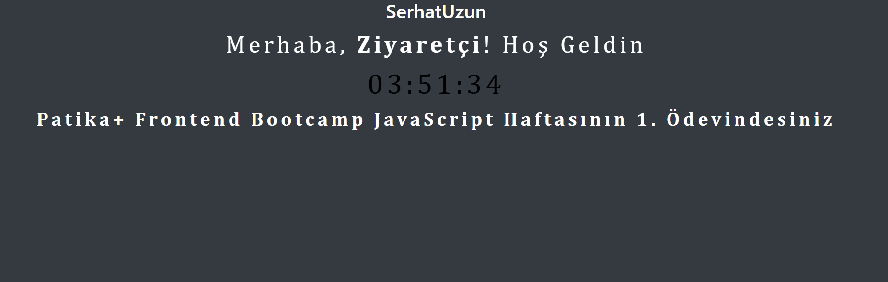

# ⏰ JavaScript Clock Work

Bu proje, **Kodluyoruz Frontend Web Development Patikası** kapsamında JavaScript kullanılarak oluşturulmuş bir dijital saat uygulamasıdır.

## 🚀 Proje Açıklaması
- Kullanıcının ismini girerek ona özel bir mesaj gösterir.
- Mevcut saati her saniye güncelleyerek ekranda gösterir.
- HTML, CSS ve JavaScript kullanılarak geliştirilmiştir.
- **Bootstrap** ile temel stil desteği eklenmiştir.

## 📸 Ekran Görüntüsü

## 📂 Dosya Yapısı
/project-folder │── index.html │── js/ │ ├── clock.js │── styles.css │── README.md

## 🛠 Kullanılan Teknolojiler
- HTML
- CSS (Bootstrap 4.6)
- JavaScript
